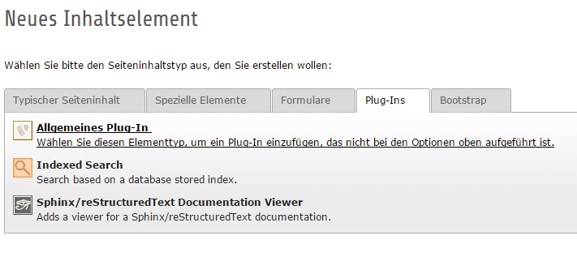
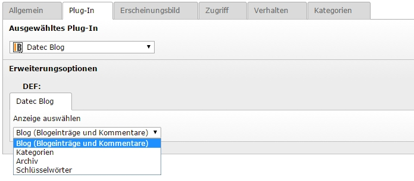

.. ==================================================
.. FOR YOUR INFORMATION
.. --------------------------------------------------
.. -*- coding: utf-8 -*- with BOM.

.. include:: ../Includes.txt

.. _admin-manual:

Administrator Manual
====================

Target group: **Administrators**

.. only:: html

	.. contents:: Within this page
		:local:
		:depth: 3

Requirements
------------

.. caution::
	Your page must have jQuery JavaScript framework loaded, as the frontend plugin depends on jQuery.

Installation
------------

1) Download and install the extension via the extension manager (extKey: datec_blog).
2) To organize blog content, create a system folder, or better yet - one for each comments, posts, categories and keywords. Note down the PID(s) of the folder(s).
3) Check the Configuration section of this manual for the required configuration and follow the steps there.
4) Insert the main plugin and optional ones as described below.

Insert plugin
-------------

1) Insert a content element, choose "Plugins" -> "General Plugin"

	Inserting content element of type "Plugin"

2) Choose one of the display forms to setup your blog.

	Choosing a display form

Blog
^^^^

Displays a the bloglist with filter and single view of posts with comments. This Plugin is required.

Categories
^^^^^^^^^^

Displays Categories as a tree, clickable for the filter.

Archive
^^^^^^^

Generates an Archive from all Blogposts, displayed as tree of year - month - day, clickable for the filter.

Keywords
^^^^^^^^

Displays Keywords as cloud or list, depending on your plugin TypoScript configuration, clickable for the filter.