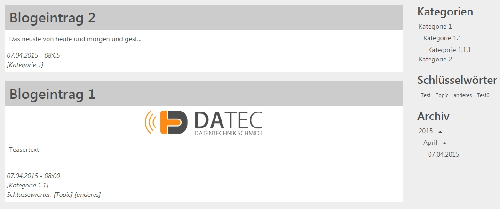

.. ==================================================
.. FOR YOUR INFORMATION
.. --------------------------------------------------
.. -*- coding: utf-8 -*- with BOM.

.. include:: ../../Includes.txt

.. _introductionDE:

Was macht es?
=============

Diese Erweiterung fügt einen leichtgewichtigen, jedoch modernen Blog zu Ihrer Homepage hinzu.
Diese Erweiterung fügt ein Frontend Plugin mit verschiedenen Ansichtsformen mit folgenden Funktionen hinzu:

* Blogsystem mit Einträgen, Kategorien, Archiv und Schlüsselwörtern
* Schreibe Text und füge Bilder ein für Blogeinträge
* Schreibe einen Anreißertext für Blogeinträge und/oder wähle ein Teaserbild 
* Organisiere Blogeinträge in Kategorien und füge Schlüsselwörter hinzu
* Zeigt Kategorien als Baum an
* Sowie das automatisch generierte Archiv
* Schlüsselwörter werden als Wolke oder Liste angezeigt, hervorgehoben nach Klicks
* Listenansicht kann nach Kategorien, Archiv-Zeiträumen und Schlüsselwörtern gefiltert werden
* Blogeinträge zeigen Kommentare hierarchisch an
* Benutzerzugriff auf Kommentarfunktion kann deaktiviert werden oder nach Benutzergruppen erfolgenfür jeden Blogeintrag
* Kommentare dürfen Datei-Uploads enthalten
* Die Kommentarfunktion ist intern Spam-geschützt, für eine barrierefreie Nutzung
* Kommentierende Benutzer werden mit Benutzername und E-Mail Adresse erfasst oder referenzieren Frontend-Benutzer und können einzeln geblockt werden
* Standard HTML ist ausgelegt für Twitter Bootstrap 3

.. tip::

	Visit & contribute: https://github.com/theorak/DatecBlog

	Datec Blog kurz nach der Installation
