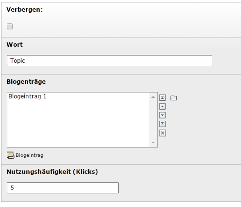

.. ==================================================
.. FOR YOUR INFORMATION
.. --------------------------------------------------
.. -*- coding: utf-8 -*- with BOM.

.. include:: ../../Includes.txt

.. _users-manualDE:

Benutzerhandbuch
================

Zielgruppe: **Redakteure und Benutzer**

.. only:: html

	.. contents:: Within this page
		:local:
		:depth: 3

Redakteure - Erstellen einer Kategorie
--------------------------------------

- Name: Name der Kategorie, muss nicht nummeriert sein
- Elternkategorie : (optional) Wählen einer Überkategorie zum Aufbau einer Hierarchie
- Verbergen: Zeige/verberge diese category
- Benutzergruppen: Steuert den Benutzerzugriff für diese Kategorie und alle enthaltenen Blogeinträge

	Erstellen eines Kategorie-Inhaltselements

Redakteure - Erstellen eines Blogeintrags
-----------------------------------------

- Titel: Titel des Blogeintrags.
- Blog-Text: Schreibe den Hauptinhalt des Blogeintrags.
- Kategorie: Setze eine Kategorie für diesen Blogeintrags.
- Schlüsselwörter: Füge ein oder mehrere Schlüsselwörter zu diesem Blogeintrag hinzu.
- Bilder: add references to images (like on Inhaltselementss), these will be displayed with a preview to click-enlarge below the post.
- Verbergen: Zeige/verberge diese blogpost.
- Start/Stop: Steuert den Zugriff auf den Blogeintrag durch Anzeigezeitraum.
- Kommentare deaktivieren: Deaktiviert die Kommentarfunktion für diesen Blogeintrag, ignoriert nachfolgende Einstellungen
- Erlaube Datei-Uploads zu Kommentaren: Fügt ein Feld für Dateien zum Kommentar-Formular hinzu
- Erlaube Benutzergruppen zu kommentieren: Steuert Zugriff auf die Kommentarfunktion für diesen Blogeintrag (NICHT SICHTBARKEIT)

	Erstellen eines Blogeintrag-Inhaltselements

Redakteure - Erstellen eines Schlüsselworts
-------------------------------------------

- Verbergen: Zeige/verberge dieses Schlüsselwort.
- Wort: Das Schlüsselwort.
- Blogeinträge: (optional) Wähle Blogeinträge in Verbindung mit diesem Schlüsselwort (kann auch bei den Blogeinträgen gewählt werden).
- Nutzungshäufigkeit (Klicks): Zeigt die Klicks des Schlüsselworts an, kann manipuliert werden um das Wort hervorzuheben.

	Erstellen eines Schlüsselwort-Inhaltselements

Redakteure - Bearbeiten/Inspizieren eines Kommentarerstellers
-------------------------------------------------------------

Kommentarersteller werden vom Plugin erzeugt um den Bezug zwischen Kommentar und Frontend-Benutzer herzustellen oder einen unangemeldeten Benutzer zu speichern. Die Redakteure können diesen Datensatz inspiezieren um E-Mail Adressen einzusehen, oder die Benutzer zu blockieren. Kommentarsteller sollten niemals gelöscht werden.

- Verbergen: Zeige/verberge diesen Kommentarersteller
- Homepage Benutzer: Enthält eine Referenz zum Frontend-Benutzer der Homepage.
- Benutzername: Vom Benutzer angeben.
- E-Mail Adresse: Vom Benutzer angegeben, auf Gültigkeit geprüft und nicht im Frontend angezeigt.
- BKommentiren sperren: Macht genau das.

	Bearbeiten eines Kommentarersteller-Inhaltselements

Benutzer - Listenansicht und Filter
-----------------------------------

Die Listenansicht der Blogeinträge ist die initiale Ansicht, sie zeigt Tiel, Anreißertext (optional), Teaserbild (optional) und das letzte Kommentar (falls vorhanden), sowie die Kategorie und Schlüsselwörter, welche diesem Blogeintrag zugeordnet wurden.
Diese Ansicht kann gefilter werden durch Ancklicken einer Kategorie, einem Archiv-Zeitraum oder Schlüsswort, einfach auswählbar über die Baum-Ansichten auf der gleichen Seite. Alles mit einem Hand-Cursor ist ancklick zum hinzufügen zum Filter, oder ein Klick auf "Filter leeren" entfernt alle diese Kriterien.

	Anzeige der Liste der Blogeinträge, hinzufügen von Filtern

Benutzer - Blogpost and Comments
--------------------------------

Um einen Blogeintrag in der Einzelansicht zu öffen, einfacht den Titel in der Liste ancklicken. Die Einzelansicht zeigt den ganzen Blogeintrag mit Text und Bildern, sowie einer hierarchischen Liste der Kommentare darunter.

Benutzer können über das eingeblendete Formular kommentieren, unangemeldete Benutzer geben einen Benutzernamen und ihre E-Mail Adresse ein, für eingeloggte Benutzer wird dieses Formular vorausgefüllt. Eingeloggte Backend-Benutzer können dies ingorieren und werden gleich als Ersteller des Kommentars übernommen. Die "Antworten"-Schaltfläche fügt ein Kommentar als Referenz zum Formular hinzu (siehe Hinweistext im Screenshot) und kann durch klicken wieder entfernt werden. Dieses Formular wird intern vor Spam-Bots geschützt.

	Anzeige der Einzelansicht eines Blogeintrags, kommentieren

Benutzer/Redakteure - Erweiterte Blog-Nutzung
---------------------------------------------

Direkt auf Blogeinträge zu verlinken kann mit folgenden einfachen Parametern erfolgen, füge sie einfach ans ende der Seiten URL hinzu (Link auf die Blog-Seite):

============================  ================================
Parameter                     Verlinkt auf
============================  ================================
&blogpost=<ID>                Blogeintrag, mit ID
#tx-datec-blog-comment-<ID>   Fokussiert auf Kommentar, mit ID
#tx-datec-blog-comments       Fokussiert auf Kommentarsektion
============================  ================================